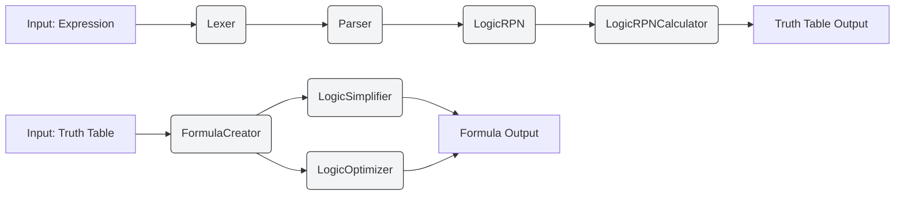
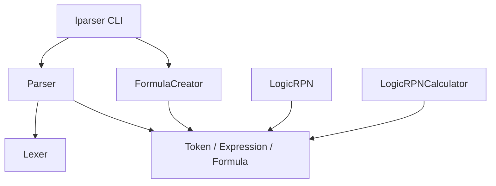

# Logic Expression Parser

A Swift package for parsing, manipulating, and analyzing logical expressions. The project can:

- Parse logical expressions and validate syntax
- Convert expressions to Reverse Polish Notation (RPN)
- Evaluate expressions and generate truth tables
- Create disjunctive normal form (DNF) formulas from truth tables
- Optionally simplify and optimize generated formulas

## Features

- Operators: AND (`*`), OR (`+`), NOT (`~`)
- Parentheses for grouping
- Output assignment with `=` (e.g. `Out = A + B * ~C`)
- Truth table generation and formula creation (DNF)
- Optional simplification and optimization passes

## Command Line Tool Usage

The package provides a command-line tool `lparser` with two main commands:

### 1. Generate Truth Table (`table`)
# Logic Expression Parser

A Swift package for parsing, manipulating, and analyzing logical expressions. This tool provides functionality for both generating truth tables from logical expressions and creating minimal logical formulas from truth tables.

## Features

- Parse logical expressions with support for:
  - AND (`*`), OR (`+`), NOT (`~`) operators
  - Parentheses for grouping
  - Variable names
  - Multiple outputs
- Generate truth tables from logical expressions
- Create minimal logical formulas from truth tables
- Simplify logical expressions using:
  - Idempotent Law (A + A = A)
  - Absorption Law (A + AB = A)
  - Complement Law (A + ~A = 1)
  - De Morgan's Laws (~(A + B) = ~A * ~B)

## Command Line Tool Usage

The package provides a command-line tool `lparser` with two main commands:

### 1. Generate Truth Table (`table`)

Convert a logical expression to a truth table:

```bash
swift run lparser table "Out = A + B * ~C"
```

The command parses the expression, converts it into RPN and evaluates it for all input combinations. Output is printed to stdout or can be written to a file using the `--output` option.

### 2. Create Formula (`formula`)

Create logical formulas from a truth table file. The file format and usage are described below.

```bash
swift run lparser formula --input path/to/table.txt --simplify --optimize
```

Flags:

- `--input <path>`: Path to truth-table input file (required)
- `--simplify`: Apply `LogicSimplifier` to produced formulas
- `--optimize`: Apply `LogicOptimizer` to produced formulas
- `--output <path>`: Write results to a file instead of printing
- `--verbose`: Show detailed formula output with variable names

## Truth-table file format

Each line contains inputs and outputs separated by `|` (inputs|outputs). Example for three inputs and two outputs:

```
000|10
001|11
010|01
011|00
100|01
101|10
110|00
111|11
```

The left side is the input bit-vector, the right side is the output bit-vector. `FormulaCreator` will build one formula per output column (DNF by default).

## How it works (brief)

- `Lexer` tokenizes the input string into `Token`s.
- `Parser` (`LeXParser`) validates token order and builds a `Formula` (output + expression tokens).
- `LogicRPN` converts infix expressions to RPN.
- `LogicRPNCalculator` evaluates RPN expressions across all input permutations to produce truth tables.
- `FormulaCreator` generates DNF expressions from truth tables and can run `LogicSimplifier` and `LogicOptimizer` to improve formulas.

## Tests

Run unit tests using Swift Package Manager:

```bash
swift test
```

## Files of interest

- CLI: `Sources/executable/lparser.swift`
- Lexer: `Sources/lib/Lexer.swift`
- Parser: `Sources/lib/LeXParser.swift`
- RPN conversion: `Sources/lib/LogicRPN.swift`
- RPN evaluation / truth-table generation: `Sources/lib/LogicRPNCalculator.swift`
- Formula creation: `Sources/lib/FormulaCreator.swift`
- Simplifier: `Sources/lib/LogicSimplifier.swift`
- Token types: `Sources/lib/Token.swift`, `Sources/lib/ExpressionSyntax.swift`

## Notes & TODO

- `LogicSimplifier` currently implements idempotent and absorption laws; complement and De Morgan transformations are TODOs.
- Lexer character validation is driven by a regex and may be adjusted for additional symbol support.

---

If you'd like, I can run the test suite now or open a PR with this README update.


```bash
swift run lparser table "Out = A + B * ~C"
```

### 2. Create Formula (`formula`)

Create logical formulas from a truth table file (optionally simplify/optimize):

```bash
swift run lparser formula --input path/to/table.txt --simplify --optimize
```

## Architecture Overview

This project is organized into a few focused modules under `Sources/lib` plus a CLI entrypoint (`Sources/executable`). There are two main flows:

- Expression -> Truth Table: Tokenize -> Parse -> Convert to RPN -> Evaluate RPN -> Print truth table
- Truth Table -> Formula: Create DNF formulas from table entries -> (optional) Simplify -> (optional) Optimize

Key components and responsibilities:

- `Lexer` (`Sources/lib/Lexer.swift`): Tokenizes input strings into `Token` instances (operands, operators, brackets, equals).
- `Parser` / `LeXParser` (`Sources/lib/LeXParser.swift`): Validates token sequence and constructs a `Formula` (output token + expression token list).
- `LogicRPN` (`Sources/lib/LogicRPN.swift`): Converts infix token lists to Reverse Polish Notation (RPN) respecting operator precedence (`~` > `*` > `+`).
- `LogicRPNCalculator` (`Sources/lib/LogicRPNCalculator.swift`): Evaluates RPN expressions for all input permutations and prints formatted truth tables.
- `FormulaCreator` (`Sources/lib/FormulaCreator.swift`): Produces DNF formulas from truth tables and can invoke `LogicSimplifier` and `LogicOptimizer`.
- `LogicSimplifier` (`Sources/lib/LogicSimplifier.swift`): Applies boolean simplifications (idempotent and absorption implemented; complement and De Morgan noted as TODO).
- `LogicOptimizer` (`Sources/lib/LogicOptimizer.swift`): Circuit-level optimization pass (refer to source for behavior).
- Core types: `Token`, `Expression` (alias for `[Token]`), `Formula` (`Sources/lib/Token.swift`, `Sources/lib/ExpressionSyntax.swift`).

## Mermaid Diagrams

High-level processing pipeline (flowchart):



Component diagram (module responsibilities):



## Supported Syntax and Notes

- Operators: `*` (AND), `+` (OR), `~` (NOT)
- Use `=` to assign an output variable: `Out = A + B * ~C`
- Lexer tokenization is driven by a regex — numeric and alphanumeric variable names are supported.

Implementation notes discovered during review:

- `Parser` enforces strict syntax rules and returns a `Formula` where `output` is the left-hand operand and `expression` contains the right-hand expression tokens.
- `LogicRPN.makeNotation` extracts an assignment prefix (`Out =`) and converts the remaining infix expression to RPN.
- `LogicRPNCalculator` builds permutations of input variables and evaluates the RPN across all permutations to form a truth table.
- `FormulaCreator` emits DNF (sum-of-products) terms for rows where the output value equals `1`, creating product terms like `(~in1 * in2 * in3)`, wrapped in parentheses.
- `LogicSimplifier` currently implements idempotent and absorption laws. The complement law and De Morgan transformations are present as TODOs and may be incomplete.

## Running Tests

Run unit tests with:

```bash
swift test
```

## Where to look in the codebase

- CLI: `Sources/executable/lparser.swift`
- Lexer: `Sources/lib/Lexer.swift`
- Parser: `Sources/lib/LeXParser.swift`
- RPN conversion: `Sources/lib/LogicRPN.swift`
- RPN evaluation / truth-table generation: `Sources/lib/LogicRPNCalculator.swift`
- Formula creation: `Sources/lib/FormulaCreator.swift`
- Simplifier: `Sources/lib/LogicSimplifier.swift`
- Tokens & syntax: `Sources/lib/Token.swift`, `Sources/lib/ExpressionSyntax.swift`

## TODO / Future Work

- Implement complement-law and De Morgan transformations in `LogicSimplifier`.
- Improve token regex if you need to support additional characters or operators.
- Add more documentation examples and exportable diagrams (SVG/PNG) for the README.

---

If you want, I can (pick one):

- run the test suite now, or
- open a PR with this README update.

Tell me which and I'll proceed.
# Logic Expression Parser

A Swift package for parsing, manipulating, and analyzing logical expressions. This tool provides functionality for both generating truth tables from logical expressions and creating minimal logical formulas from truth tables.

## Features

- Parse logical expressions with support for:
  - AND (`*`), OR (`+`), NOT (`~`) operators
  - Parentheses for grouping
  - Variable names
  - Multiple outputs
- Generate truth tables from logical expressions
- Create minimal logical formulas from truth tables
- Simplify logical expressions using:
  - Idempotent Law (A + A = A)
  - Absorption Law (A + AB = A)
  - Complement Law (A + ~A = 1)
  - De Morgan's Laws (~(A + B) = ~A * ~B)

## Command Line Tool Usage

The package provides a command-line tool `lparser` with two main commands:

### 1. Generate Truth Table (`table`)

Convert a logical expression to a truth table:
